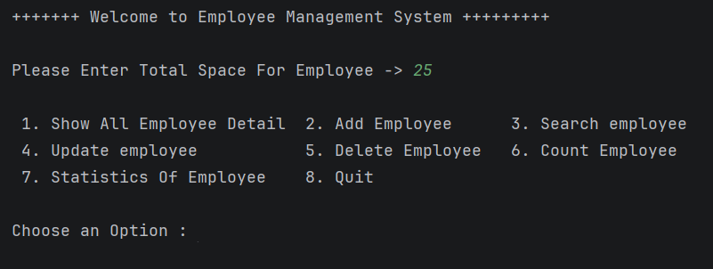
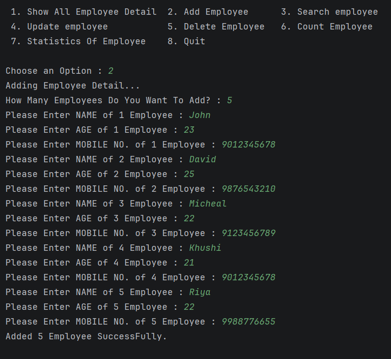
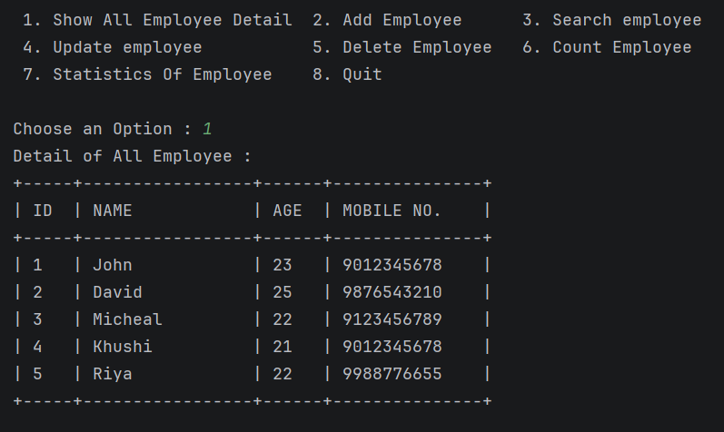
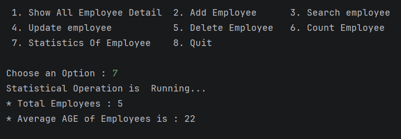

<h1 align="center">👨‍💼 Employee Management System</h1>

<p align="center">
  
</p>

<p align="center">
  
  
  
</p>

---

## 🚀 Project Overview

A **Console-Based Employee Management System** developed using **Core Java** to practice fundamental programming concepts.

This project allows users to manage employee records through a menu-driven interface.

---

## 📅 Project Timeline

| Milestone                 | Date               |
|---------------------------|--------------------|
| 🚀 **Started**            | 12 June 2026       |
| ✅ **Version 1 Completed** | 21 June 2026       |
| 🔄 **Last Updated**       | Active Development |

---

## ✨ Features

✅ Add Employee

✅ Show All Employees

✅ Search Employee By ID

✅ Update Employee Details

✅ Delete Employee Records

✅ Count Employees Using Recursion

✅ Employee Statistics *(Coming Soon)*

---

## 📸 Program Preview

| Main Menu | Add Employee |
|-----------|-------------|
|  |  |

| Employee List | Statistics |
|---------------|----------------|
|  |  |

---
## 🛠️ Technologies Used

| Technology  | Purpose              |
| ----------- | -------------------- |
| Java        | Programming Language |
| Scanner     | User Input           |
| 2D Arrays   | Data Storage         |
| Methods     | Code Reusability     |
| Loops       | Iteration            |
| Switch Case | Menu Navigation      |
| Recursion   | Employee Counting    |

---

## 📂 Project Structure

```text
EmployeeManagementSystem
│
├── images
│    ├── main-menu.png
│    ├── add-employee.png
│    ├── show-employee.png
│    └── statistic-menu.png
│
├── src
│    └── Project_01_EmployeeManageSystem.java
│
└── README.md
```

## 📋 Menu Options

```text
1. Show All Employee Detail
2. Add Employee
3. Search Employee
4. Update Employee
5. Delete Employee
6. Count Employee
7. Statistics Of Employee
8. Quit
```

---

## 🧠 Concepts Practiced

* Arrays
* Methods
* Recursion
* Scanner Class
* Conditional Statements
* Loops
* Switch Statements
* Problem-Solving
* CRUD Operations

---

## 🔮 Future Enhancements

* Search Employee By Name
* Employee Statistics
* File Handling
* JDBC Database Integration
* GUI Version 

---

## 📈 Learning Progress

```text
Core Java Fundamentals      ██████████ 100%
Arrays & Methods            ██████████ 100%
CRUD Operations             ██████████ 100%
Recursion                   ████████░░ 80%
File Handling               ███░░░░░░░ 30%
JDBC Integration            ░░░░░░░░░░ 0%
```

---

## 👨‍💻 Author

**Raunak Singh**

Learning Java one concept at a time and building projects to strengthen problem-solving and software development skills.

⭐ If you found this project useful, consider giving it a star.
